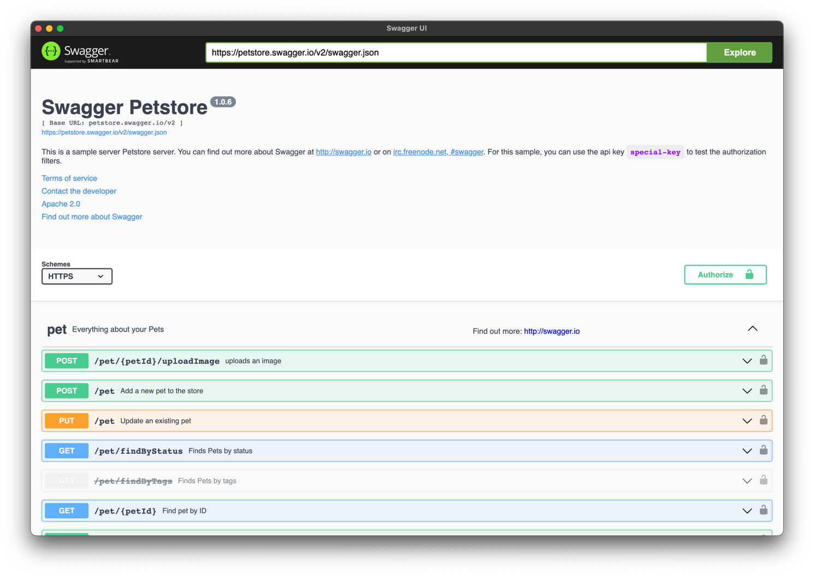
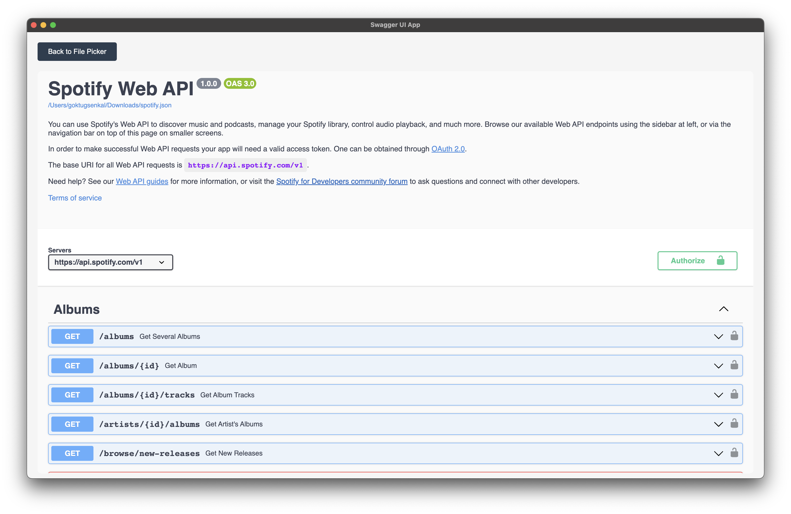

# Swagger UI Electron

An Electron-based desktop wrapper around the official Swagger UI Dist package, enhanced to conveniently browse local Swagger JSON files directly from your Downloads folder.

This project uses the latest `swagger-ui-dist` published by the Swagger Team, ensuring it's always up-to-date.

## Features

- Automatically scans your `~/Downloads` directory for Swagger JSON files.
- Lists available Swagger files sorted by creation date (newest first).
- Clearly displays the Swagger API title and version for easy selection.
- Integrated navigation between file selection and Swagger UI view.

## Installation

Ensure you have [NodeJS](https://nodejs.org/) installed. Clone the repository and build from source:

```shell
git clone <repository-url>
cd swagger-ui-electron
npm install
npm run build
```

Copy the generated executable from the `out` folder to your desired installation location:

### macOS

For example, to copy an ARM Mac build:

```shell
cp -R ./out/swagger-ui-electron-darwin-arm64/swagger-ui-electron.app ~/Applications
```

### Windows

Run the Squirrel installer located at:

```
out/make/squirrel.windows/x64/swagger-ui-electron-X.X.X Setup.exe
```

This installer places the app in `%LOCALAPPDATA%\SwaggerUi`, from which it can be pinned to the Start menu.

Alternatively, manually copy the built app from:

```
out/swagger-ui-electron-win32-x64
```

to your desired location, such as `Program Files`.

See [Electron Forge - Squirrel.Windows](https://www.electronforge.io/config/makers/squirrel.windows) for additional details.

## Usage

Upon opening, the application displays a list of Swagger JSON files found in your Downloads folder. Select a file to load it in Swagger UI.


Use the provided "Back to File Picker" button to return to the file selection view.



## Built With

- [Electron](https://www.electronjs.org/)
- [swagger-ui-dist](https://www.npmjs.com/package/swagger-ui-dist)

## Credits

This project is a fork of [swagger-ui-electron](https://github.com/JonathanTurnock/swagger-ui-electron) by [Jonathan Turnock](https://github.com/JonathanTurnock) with minor modifications.


