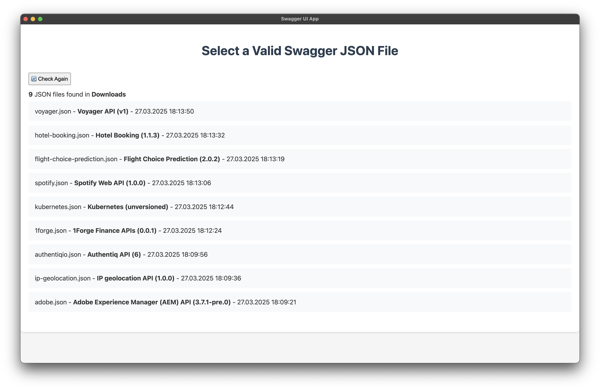

# Swagger UI Electron

Small electron wrapper around the Swagger UI Dist package to serve it locally.

## Installation

The project must be built from source, so requires NodeJS to be installed.

Install Dependencies
```shell
$ npm install
```

Build Package
```shell
$ npm run make
```

Copy the system compatible executable from the `out` folder to your desired install location.

i.e. On OSX
```shell
$ cp -R ./out/swagger-ui-electron-darwin-arm64/swagger-ui-electron.app ~/Applications
```

## Usage

By default, it loads the example petstore swagger spec, change the URL to point to the desired API 
spec and press explore to load it.



## Built With

- https://www.electronjs.org/
- https://www.npmjs.com/package/swagger-ui-dist